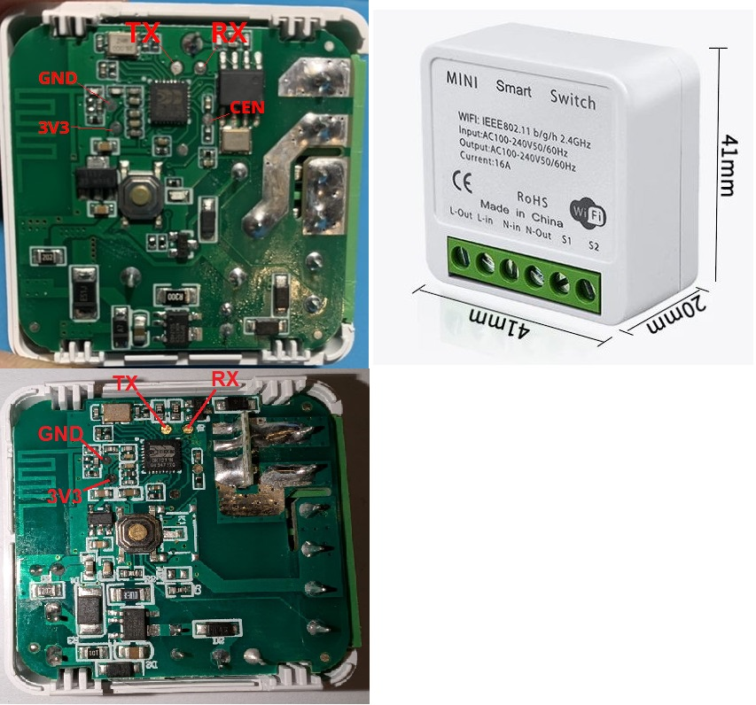
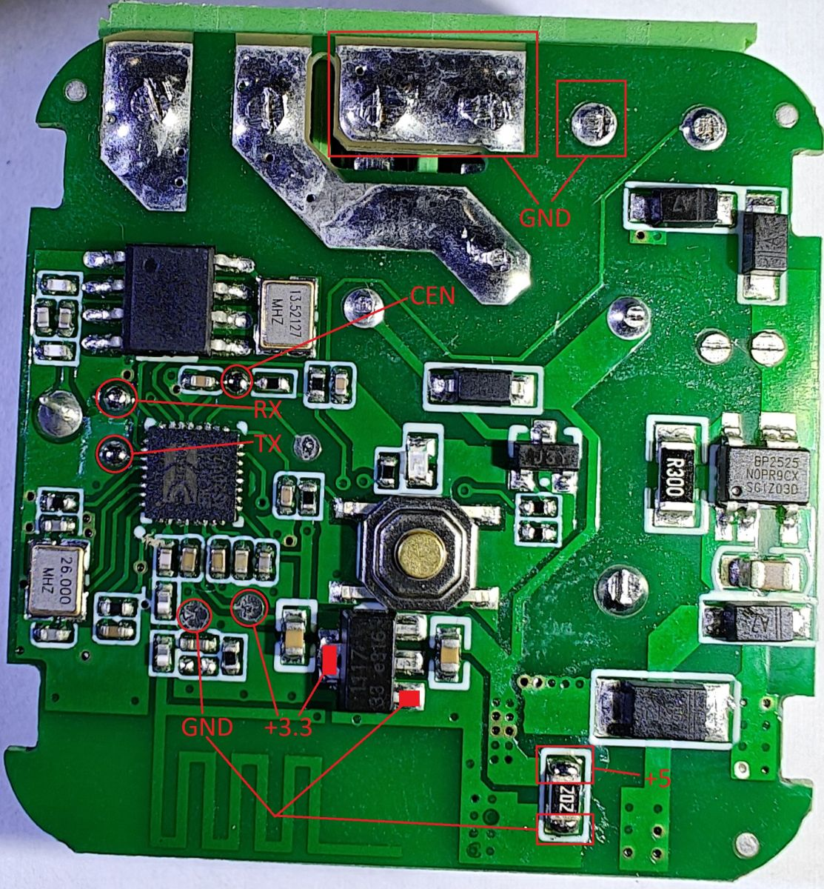
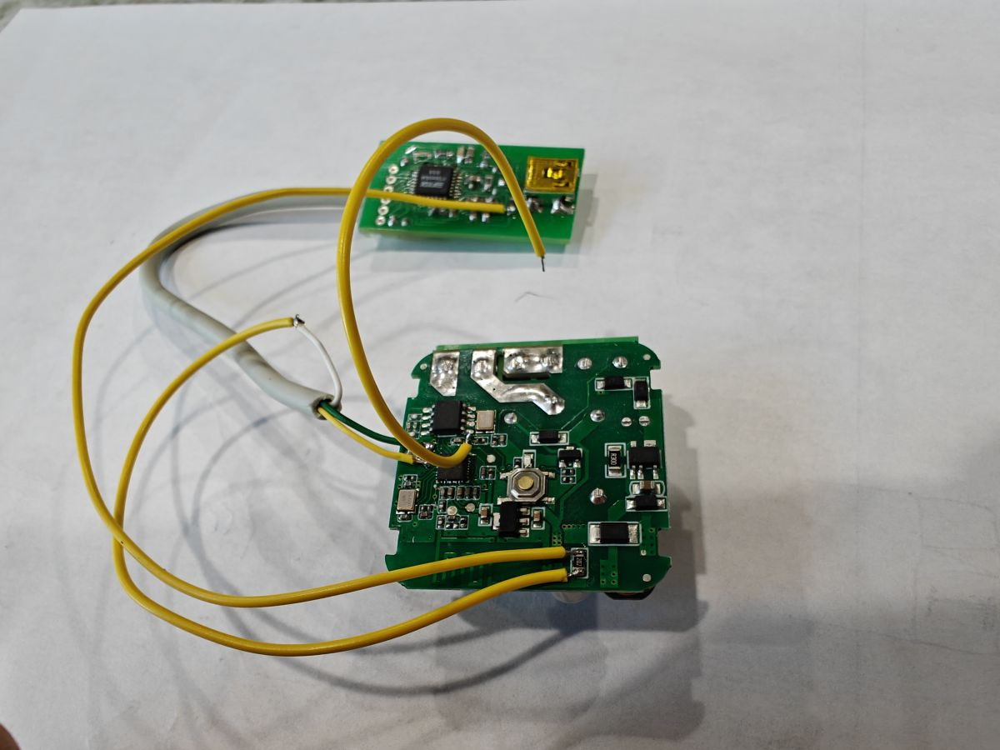

## General Notes

A smart WIFI relay to convert a normal swicht into a smart switch and retain the fuction of the normal switch.

Some modules have RF433 fuction but not included below.

These devices are sold under many brands on Aliexpress.

Similar one can be found here [Aubees Mini Smart Switch](../Aubees-Mini-Smart-Switch/index.md)



## GPIO Pinout

| Pin | Function                   |
| --- | -------------------------- |
| P6  | Rocker switch INPUT_PULLUP |
| P7  | Relay (H)                  |
| P8  | RF input ?                 |
| P23 | Button INPUT_PULLUP        |
| P26 | Blue Status LED (H)        |

> The details of the board can be found here [BK7231N](../boards/generic-bk7231n-qfn32-tuya.md)

I looked for the cheapest ones because my goal is not to use them as is, but rather re-flash them to my liking and use in my home assistant setup.
Let's crack them open! There is just a single board inside. Terminals, relay and power supply inductor/capacitors on one side (+antenna for RF version):

and all other electronics including BK7231N, power supply chips, and other discrete components (RF version also has what seems to be a SYN470R receiver chip) on the other side:

Not sure about the receiver - it is an unmarked chip, but connections seem to match the 8-pin package pinout in the datasheet. Exact model of receiver chip is not important though. So let's find out how to reprogram these boards. I used a multimeter with really thin and sharp probes to probe BK chip pads directly and found out all the required connection points and where peripherals connected to.



There are very conveniently placed test pads for CEN, RX and TX pins. They are easily accessible to solder with a soldering iron.
There are also pads for GND and +3.3, but they are not so conveniently located - there are other components nearby. However, it is a blessing in disguise as this board has a 3.3 volt regulator, so we can power it from USB directly! Just solder 2 wires on each side of 2K resistor and we are golden.



2 middle pins of the main connector form a large unmasked surface which is connected to ground. That makes it a perfect point to touch with a wire soldered to CEN pad to initiate chip reprogramming.

## Peripheral connections

- Relay is connected to P7
- Button is connected to P23
- LED is connected to P26
- External Switch (main terminals) shorts P6 to ground
- RF reciever is on P8 (on the WiFi+RF board only)

> If you want to go with OpenBK Firmware, Then

1. Download the latest BK7231 Flash Tool from [GitHub](https://github.com/openshwprojects/BK7231GUIFlashTool)
2. Run it and click on the `Download latest from the web` button.
3. Select the right COM port for your USB-Serial adapter.
4. Select BK7231N chip.
5. Click the `Do backup and flash new" button, short the CEN to GND momentarily and the flashing process will begin.

    > It should extract the template and pin mapping just fine except the RF pin.

6. Go to your router, discover the IP address of your newly flashed module. Go to http://<device_ip> and finish the setup by clicking on the `config` button. From the config menu go to Configure Module if you want to reconfigure pins. I personally found WiFiLED_n useless, so I changed it to LED_n with channel 1. I plan to 3D print a switch housing, so LED_n will light up when the switch is off, making it easier to find in the dark.  
    Finally, on the Configure MQTT page put the address and user/password to connect to your MQTT Broker and the most basic setup is done.

This is an easy way and works beautifully for the WiFi version of the switch (no RF). I wasn't able to figure out how to configure RF. Apparently it needs some scripts, starting a driver etc. Not so easy anymore. Also my end goal is to use it with Home Assistant, So i decided to go another way and install the ESPHome Firmware instead.

> If you want to go with ESPHome Firmware, then

1. Setup the ESPHome either as an add-on or the container according to your convenience.
2. Also this can be done by installing esphome command line along with libretiny platform.

      ```python
     pio pkg install --platform libretiny
     ```

3. I am using the ESPHome Builder in the home assistant. So head over to the Builder and create a new device and name it appropriately.
4. Then compile and download the binary files in the UTF2 format (which is also the recommended). Or if you have done it using the command line then compile it there accordingly.
5. Download the ltchiptool program to flash the board from [here](https://github.com/libretiny-eu/ltchiptool/releases/latest) and run it.
6. [Optional but Recommended] Let's backup the chip flash just in case. In the flasher GUI select the COM port and choose the `Read Flash` option. Select the output file, select the `Beken 72XX` chip family and click start. It will begin the backup process. Don't forget to short `CEN` to ground to initiate the communication with chip. Be patient it takes quite a few minutes to complete.
7. Let's flash it! In the flasher GUI select the COM port and choose `Write Flash` option. Select the input file compiled in the above step 4 and slect the `BK72XX` chip family and click start. It will begin the flashing process. Don't forget to short `CEN` to ground to initiate the communication with the chip.
8. You are done. Now go to Home Assistant, discover the new ESPHome device and add it. No need to setup MQTT.

## Configuration

```yaml
## -----------------------##
## Substitution Variables ##
## -----------------------##
substitutions:
  device_friendly_name: WIFI Switch
  device_name: wifi-switch
  device_icon: "mdi:power"
## --------------------##
## Board Configuration ##
## --------------------##
esphome:
  name: ${device_internal_name}
  friendly_name: ${device_friendly_name}

bk72xx:
  board: generic-bk7231n-qfn32-tuya
## ---------------- ##
##    Status LED    ##
## If there is an error in ESPHome, the diode blinks. If everything is fine, the indicator can be controlled from HA
## ---------------- ##
light:
  - platform: status_led
    name: "Status"
    id: led
    pin:
      number: P26

## ---------------- ##
##  Binary Sensors  ##
## ---------------- ##
binary_sensor:
# Button back
  - platform: gpio
    id: button_1
    pin:
      number: P23
      inverted: true
      mode: INPUT_PULLUP
    on_press:
      then:
        - switch.toggle: relay
    filters:
      - delayed_on_off: 50ms
# Rocker switch
  - platform: gpio
    name: "External Switch"
    pin:
      number: P6
      inverted: true
      mode: INPUT_PULLUP
    on_press:
      then:
        - switch.turn_on: relay
    on_release:
        - switch.turn_off: relay
    filters:
      - delayed_on_off: 50ms

## ---------------- ##
##      Switch      ##
## ---------------- ##
switch:
#Relay
  - platform: output
    name: "Relay"
    icon: ${device_icon}
    output: relayoutput
    id: relay
    on_turn_on:
      - light.turn_on: led
    on_turn_off:
      - light.turn_off: led
    restore_mode: ALWAYS_OFF

## ---------------- ##
##      Relays      ##
## ---------------- ##
output:
  # Relay
  - platform: gpio
    id: relayoutput
    pin: P7
```
